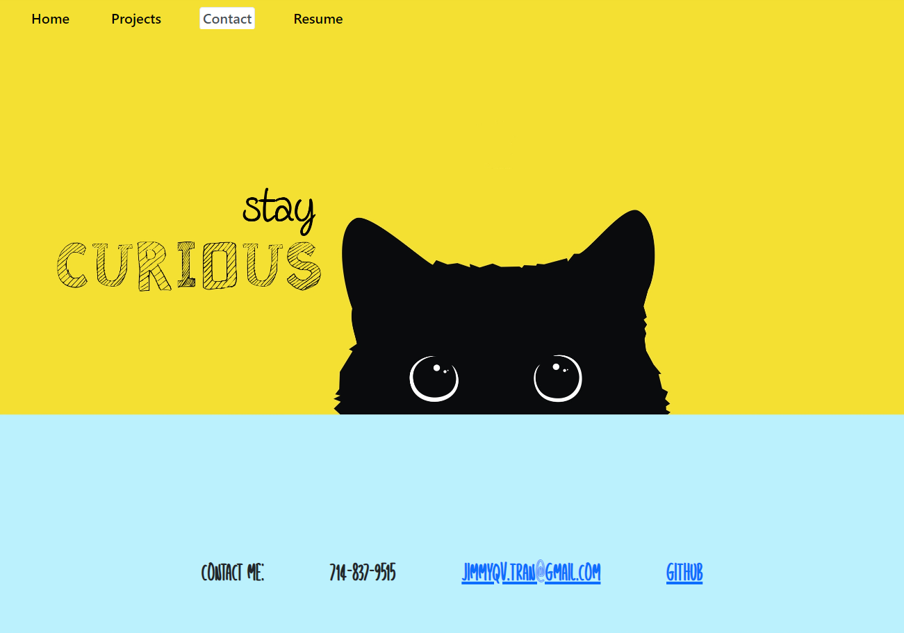

# React Portfolio

This portfolio contacts some of the work I've completed. It was designed using React.

## Table of contents

- [Installation](#installation)
- [Credits](#credits)
- [License](#license)
- [Contribute](#contribute)
- [Questions](#questions)

## Installation

First, open up the terminal and run "npm i" then "npm run develop" to start both the client and the server.

## Credits

I would like to thank My friends, family, and instructors at UCSD bootcamp. for their support during the development of this application.

## License

This project is licensed under None.

## Questions

If you have any questions, please direct them towards my email at Jimmyqv.tran@gmail.com.  
The app can be found <a href="">. You can find more of my work at github.com/yippeejimmee.

